# Customer360 — Full Project Flow

## 1. Architecture Overview

This project implements a **Customer 360** data lakehouse using **Medallion Architecture** (Bronze → Silver → Gold) with Spark Structured Streaming, Hudi, and real-time CDC ingestion.

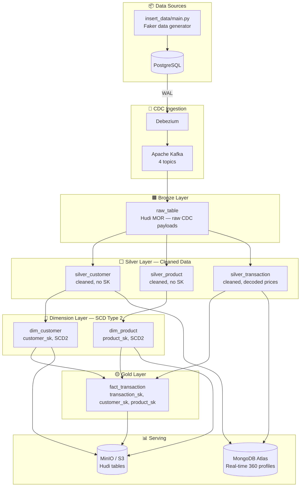

---

## 2. Data Sources — `insert_data/main.py`

A Python script using **Faker** populates 4 PostgreSQL tables:

| Table | Key Fields | Notes |
|---|---|---|
| `customer` | customer_id (UUID), phone_number, name, email … | Pre-registered customers |
| `product` | product_id (serial), price, base_price, product_type … | Catalog |
| `transaction` | transaction_id, customer_id, phone_number, source … | 3 types of purchase |
| `event` | event_id, customer_id, type (view / add-to-cart), url | Clickstream |

### 3 Transaction Scenarios

| `i` | Scenario | `customer_id` | `phone_number` | `source` |
|---|---|---|---|---|
| `1` | Online (web) | Existing | Existing | `web` |
| `2` | In-store, **NEW** customer | New UUID | Random new phone | `store` |
| `0` | In-store, existing customer | Existing | Existing | `store` |

---

## 3. CDC Ingestion — Debezium → Kafka

**Debezium** watches PostgreSQL's WAL and emits every change as a CDC event to Kafka:

| Kafka Topic | Source Table |
|---|---|
| `e-commerce-customer.public.customer` | `customer` |
| `e-commerce-product.public.product` | `product` |
| `e-commerce-transaction.public.transaction` | `transaction` |
| `e-commerce-event.public.event` | `event` |

Each message follows the Debezium CDC envelope:
```json
{
  "after":  { ... },
  "op": "c",
  "ts_ms": 1234567890
}
```

> [!NOTE]
> Debezium encodes PostgreSQL `DECIMAL` columns as **Base64 strings** (big-endian unscaled bytes). `TransformUtils.decodeDecimalUdf` handles this decoding throughout the pipeline.

---

## 4. Spark Pipeline — Layer by Layer

### 4.1 Extract — `ExtractKafka`

All 4 Kafka topics are consumed as Spark Structured Streaming DataFrames, each with columns: `offset`, `topic`, `key` (table name), `value` (raw JSON).

They're **union-ed** into a single combined stream:
```scala
val combinedRawDf = customerStreamDf.union(productStreamDf).union(eventStreamDf).union(transactionDf)
```

---

### 4.2 Bronze — `raw_table`

The combined stream is written **as-is** to Hudi (MOR) at `s3a://tables/bronze/raw_table/`. This is the **immutable audit log** — zero transformation.

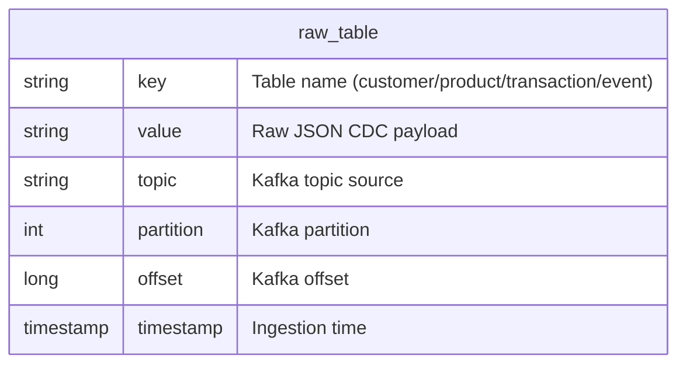

---

### 4.3 Silver — Cleaned Data (No Surrogate Keys)

Silver tables store **cleaned, typed** data — decoded decimals, normalized phone numbers, proper date types — but **no surrogate keys** and **no SCD2 history**.

#### `silver_customer` — [TransformCustomerSilver.scala](file:///e:/Mine/Code/Customer360/pipeline/src/main/scala/transformers/TransformCustomerSilver.scala)

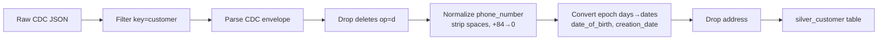

**Schema:**
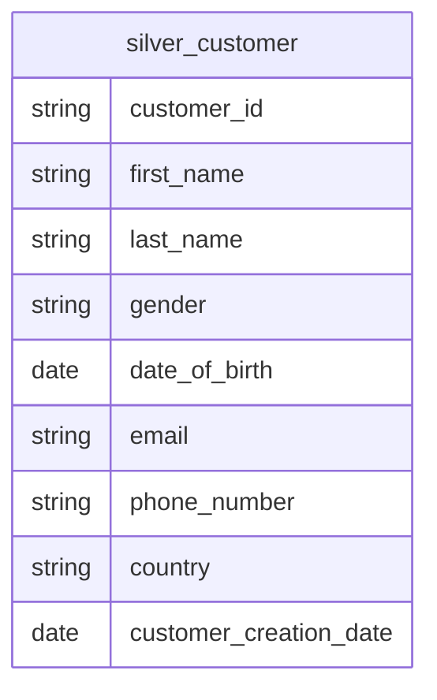

Also written to **MongoDB Atlas** for real-time customer lookup.

---

#### `silver_product` — [TransformProductDim.scala](file:///e:/Mine/Code/Customer360/pipeline/src/main/scala/transformers/TransformProductDim.scala)

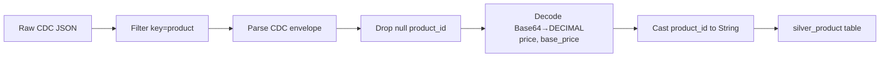

**Schema:**
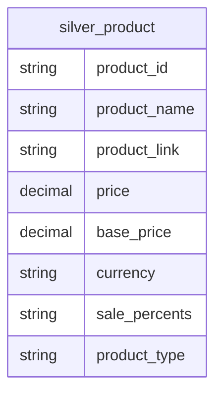

---

#### `silver_transaction` — [TransformTransactionSilver.scala](file:///e:/Mine/Code/Customer360/pipeline/src/main/scala/transformers/TransformTransactionSilver.scala)

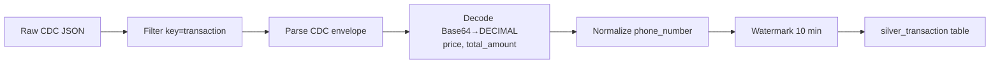

**Schema:**
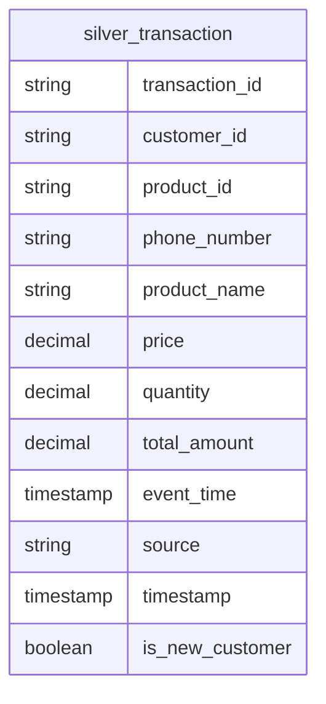

Also runs a **resolve step**: joins with MongoDB customer lookup → writes enriched transactions to MongoDB for 360 profiles.

---

### 4.4 Dimension Tables — SCD Type 2 (With Surrogate Keys)

Both dimension tables are derived **from their silver counterparts** via `SqlStreamService` using `foreachBatch`. Each micro-batch:

1. **Upserts** cleaned data into the silver table
2. **Generates** a surrogate key (UUID) for each row
3. **Expires** existing current rows in the dim table (`is_current=false, expired_date=today`)
4. **Inserts** new dim rows (`is_current=true, expired_date=9999-12-31`)

#### `dim_customer`

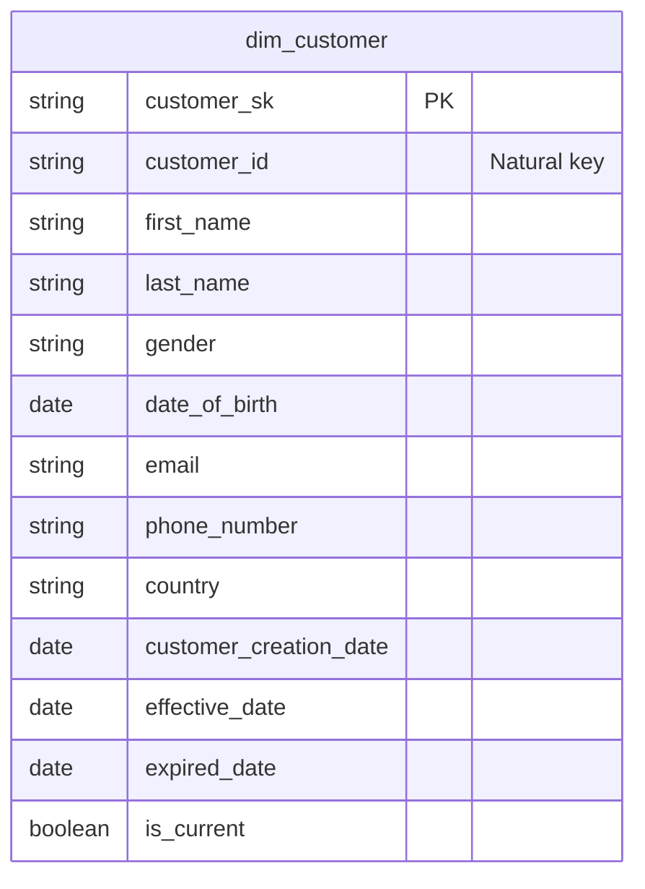

#### `dim_product`

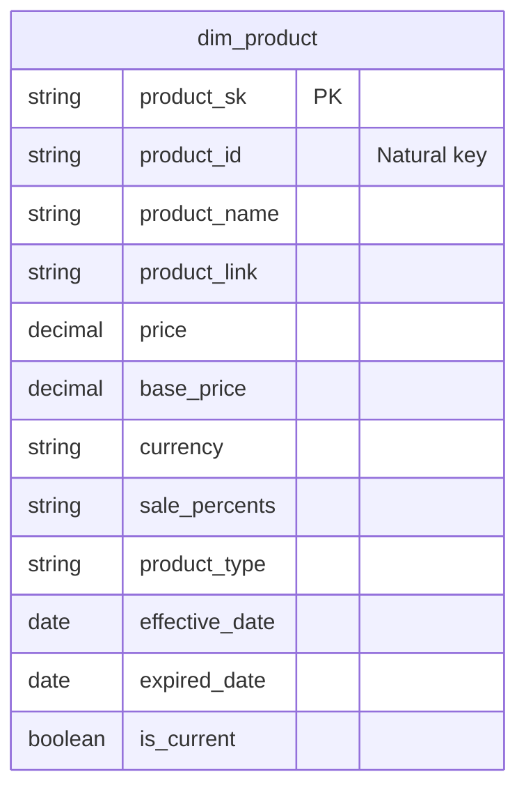

#### `dim_date`

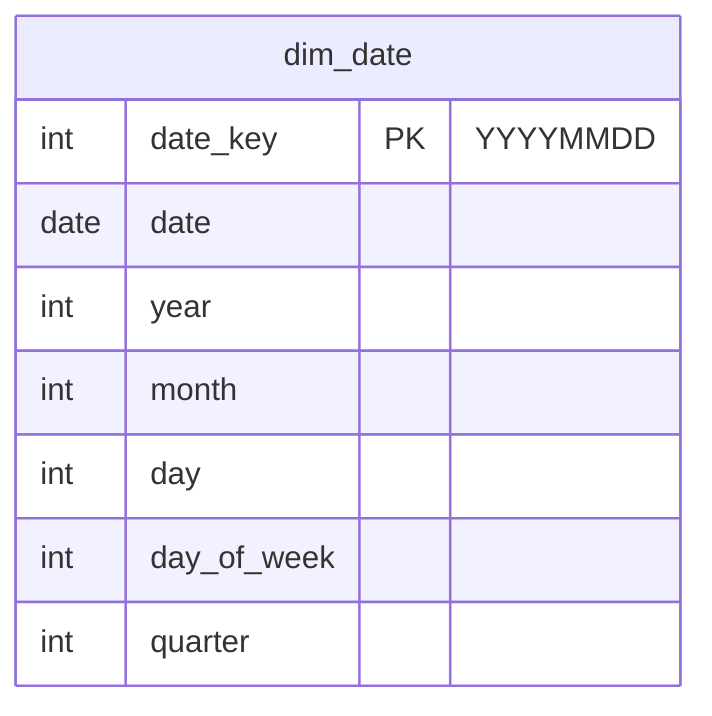

---

### 4.5 Gold — `fact_transaction`

#### [TransformFactTransaction.scala](file:///e:/Mine/Code/Customer360/pipeline/src/main/scala/transformers/TransformFactTransaction.scala) — `processFactBatch()`

Runs via `foreachBatch` on the silver_transaction stream. Resolves all surrogate keys:

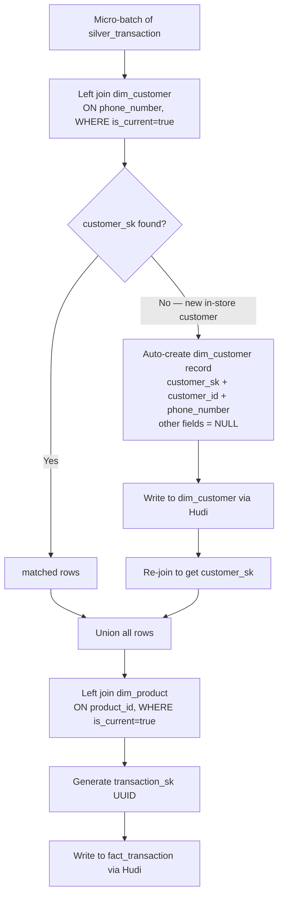

**Final Star Schema:**

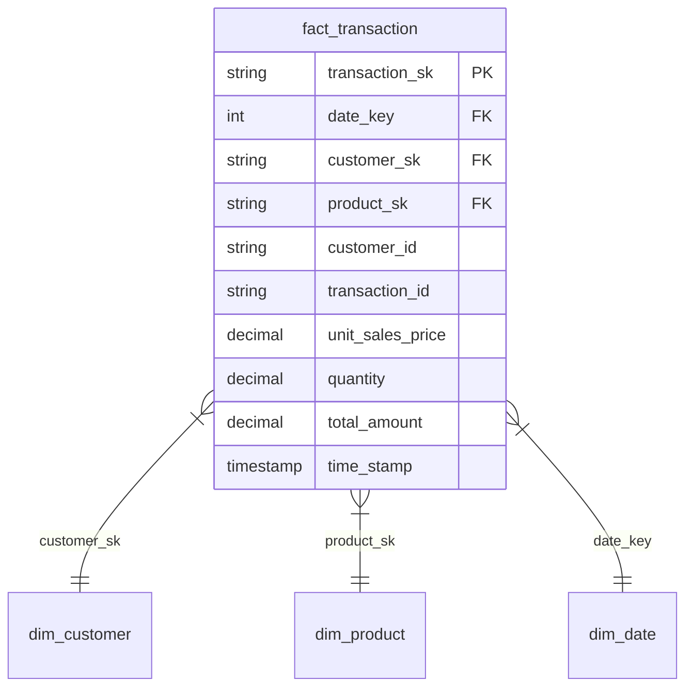

> [!IMPORTANT]
> `customer_sk` is **never null** in the fact table. If an in-store customer doesn't exist in dim_customer, a minimal record is auto-created with only `customer_id`, `customer_sk`, and `phone_number` populated. Other fields remain NULL until the customer registers.

---

### 4.6 Events & Unified Profiles → MongoDB

#### [TransformEvent.scala](file:///e:/Mine/Code/Customer360/pipeline/src/main/scala/transformers/TransformEvent.scala) & [TransformUnifiedProfile.scala](file:///e:/Mine/Code/Customer360/pipeline/src/main/scala/transformers/TransformUnifiedProfile.scala)

Clickstream events and transactions are aggregated by `customer_id` and written to **MongoDB Atlas** to create a single **Unified Customer Profile**.

**Unified Profile Schema (MongoDB):**

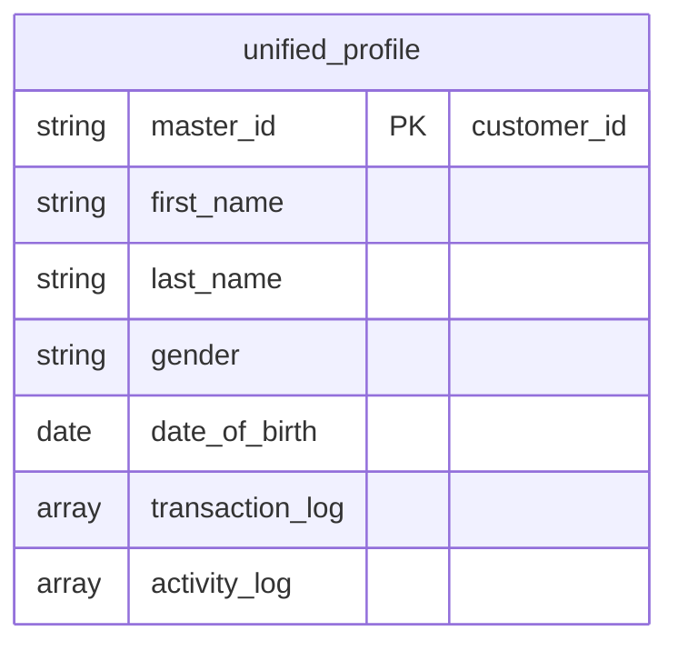

> [!NOTE]
> `transaction_log` contains an array of recent purchases (id, price, quantity, total), and `activity_log` contains clickstream events (id, type, url, timestamp).

---

## 5. Utilities — `TransformUtils`

| Utility | Purpose |
|---|---|
| `decodeDecimalUdf` | UDF: Debezium Base64 → `java.math.BigDecimal` (scale=2) |
| `normalizePhoneNumber` | Strips spaces/parens/dashes, replaces `+84` → `0` |

---

## 6. Infrastructure (Docker Compose)

| Service | Role |
|---|---|
| **PostgreSQL** | Source OLTP database |
| **Debezium / Kafka Connect** | CDC connector watching PostgreSQL WAL |
| **Apache Kafka** | Message broker (4 topics) |
| **Spark Master + Workers** | Distributed stream processing |
| **Hive Metastore** | Catalog for Hudi tables |
| **MinIO** | S3-compatible object storage (Bronze/Silver/Gold) |
| **MongoDB Atlas** | Cloud NoSQL for real-time customer 360 profiles |

---

## 7. End-to-End Summary

```
PostgreSQL (4 tables)
  → Debezium CDC (WAL capture)
    → Kafka (4 topics)
      → Spark Structured Streaming
          │
          ├─ Bronze: raw_table (Hudi, MinIO) — immutable audit log
          │
          ├─ Silver (cleaned, no SK):
          │   ├─ silver_customer   → also → MongoDB Atlas
          │   ├─ silver_product
          │   └─ silver_transaction → also → MongoDB Atlas (resolved)
          │
          ├─ Dimensions (SCD2, with SK):
          │   ├─ dim_customer  ← derived from silver_customer
          │   └─ dim_product   ← derived from silver_product
          │
          └─ Gold:
              └─ fact_transaction ← joins dim_customer + dim_product
                                    auto-creates dim_customer for new in-store customers
```
